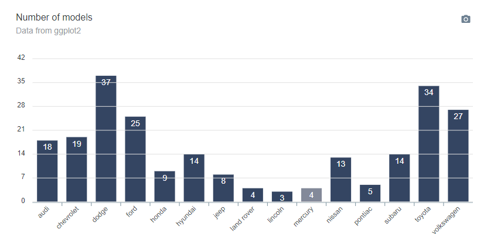
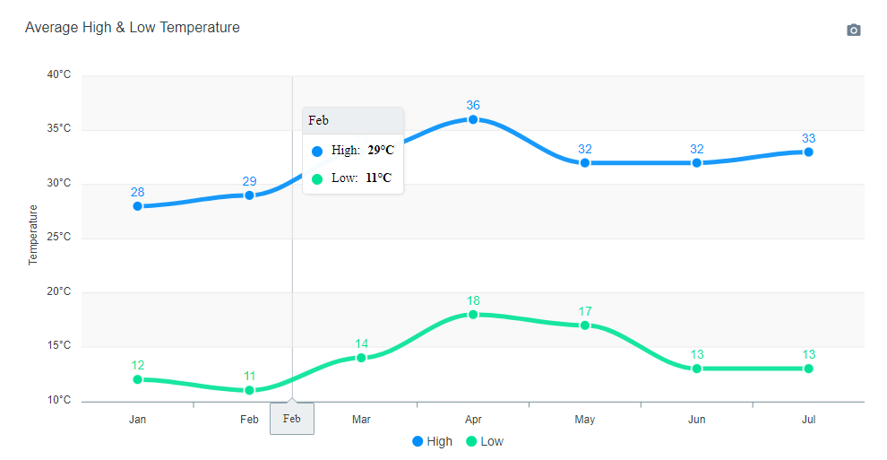

# apexcharter

> Htmlwidget for [apexcharts.js](https://github.com/apexcharts/apexcharts.js) : A modern JavaScript charting library to build interactive charts and visualizations with simple API.

[](https://travis-ci.org/dreamRs/apexcharter)
[](https://www.repostatus.org/#wip)

:construction: Under development !! API will change :construction:

:warning: Use RStudio >= 1.2 to properly display charts


Note: Once again, development is heavily inspired by amazing [highcharter](http://jkunst.com/highcharter/).


## Installation

You can install the development version from [GitHub](https://github.com/) with:

``` r
# install.packages("devtools")
devtools::install_github("dreamRs/apexcharter")
```


## Quick Charts

Use `apex` function to quickly create visualizations :


```r
library(apexcharter)

data("mpg", package = "ggplot2")
n_manufac <- dplyr::count(mpg, manufacturer)

apex(data = n_manufac, type = "bar", mapping = aes(x = manufacturer, y = n))
```


With datetime:

```r
data("economics", package = "ggplot2")
apex(data = economics, type = "line", mapping = aes(x = date, y = uempmed)) %>% 
  ax_stroke(width = 1)
```


## Full API

Simple bar chart :

```r
library(apexcharter)
library(ggplot2) # for data
library(dplyr)
library(magrittr)

data(mpg)
dat <- count(mpg, manufacturer)

apexcharter() %>% 
  ax_chart(type = "bar") %>% 
  ax_plotOptions(bar = barOpts(
    horizontal = FALSE,
    endingShape = "flat",
    columnWidth = "70%",
    dataLabels = list(
      position = "top"
    ))
  ) %>% 
  ax_grid(
    show = TRUE,
    position = "front"
  ) %>% 
  ax_series(list(
    name = "Count",
    data = dat$n
  )) %>% 
  ax_colors("#112446") %>% 
  ax_xaxis(categories = dat$manufacturer) %>% 
  ax_title(text = "Number of models") %>% 
  ax_subtitle(text = "Data from ggplot2")
```




## Raw API

Pass a list of parameters to the function:

``` r
apexcharter(ax_opts = list(
  chart = list(
    type = "line"
  ),
  stroke = list(
    curve = "smooth"
  ),
  grid = list(
    borderColor = "#e7e7e7",
    row = list(
      colors = c("#f3f3f3", "transparent"),
      opacity = 0.5
    )
  ),
  dataLabels = list(
    enabled = TRUE
  ),
  markers = list(style = "inverted", size = 6),
  series = list(
    list(
      name = "High",
      data = c(28, 29, 33, 36, 32, 32, 33)
    ),
    list(
      name = "Low",
      data = c(12, 11, 14, 18, 17, 13, 13)
    )
  ),
  title = list(
    text = "Average High & Low Temperature",
    align = "left"
  ),
  xaxis = list(
    categories = month.abb[1:7]
  ),
  yaxis = list(
    title = list(text = "Temperature"),
    labels = list(
      formatter = htmlwidgets::JS("function(value) {return value + '°C';}")
    )
  )
))
```



