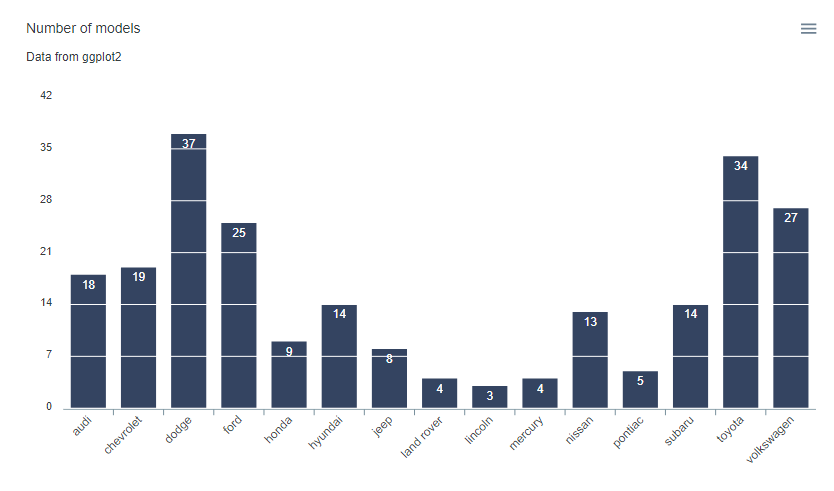
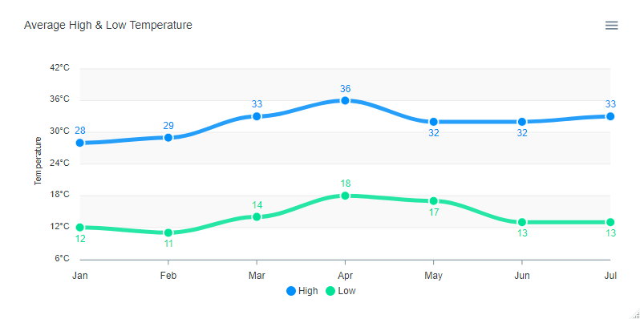

# apexcharter

> Htmlwidget for [apexcharts.js](https://github.com/apexcharts/apexcharts.js) : A modern JavaScript charting library to build interactive charts and visualizations with simple API. See the [online documentation](https://dreamrs.github.io/apexcharter/) for examples.

<!-- badges: start -->
[](https://CRAN.R-project.org/package=apexcharter)
[](https://cran.r-project.org/web/checks/check_results_apexcharter.html)
[](https://app.codecov.io/gh/dreamRs/apexcharter?branch=master)
[](https://github.com/dreamRs/apexcharter/actions/workflows/R-CMD-check.yaml)
<!-- badges: end -->


## Installation

Install from [CRAN](https://CRAN.R-project.org/package=apexcharter) with:

```r
install.packages("apexcharter")
```

Or install the development version from [GitHub](https://github.com/dreamRs/apexcharter) with:

```r
# install.packages("remotes")
remotes::install_github("dreamRs/apexcharter")
```


## Quick Charts

Use `apex` function to quickly create visualizations :


```r
library(apexcharter)
data("mpg", package = "ggplot2")
apex(data = mpg, type = "bar", mapping = aes(manufacturer))
```


With datetime:

```r
data("economics", package = "ggplot2")
apex(data = economics, type = "line", mapping = aes(x = date, y = uempmed)) %>% 
  ax_stroke(width = 1)
```


## Full API

All methods from ApexCharts are available with function like `ax_*` compatible with pipe from `magrittr` :

```r
library(apexcharter)
data(mpg, package = "ggplot2")

apexchart() %>% 
  ax_chart(type = "bar") %>% 
  ax_plotOptions(bar = bar_opts(
    horizontal = FALSE,
    endingShape = "flat",
    columnWidth = "70%",
    dataLabels = list(
      position = "top"
    ))
  ) %>% 
  ax_grid(
    show = TRUE,
    position = "front",
    borderColor = "#FFF"
  ) %>% 
  ax_series(list(
    name = "Count",
    data = tapply(mpg$manufacturer, mpg$manufacturer, length)
  )) %>% 
  ax_colors("#112446") %>% 
  ax_xaxis(categories = unique(mpg$manufacturer)) %>% 
  ax_title(text = "Number of models") %>% 
  ax_subtitle(text = "Data from ggplot2")
```




## Raw API

Pass a list of parameters to the function:

```r
apexchart(ax_opts = list(
  chart = list(
    type = "line"
  ),
  stroke = list(
    curve = "smooth"
  ),
  grid = list(
    borderColor = "#e7e7e7",
    row = list(
      colors = c("#f3f3f3", "transparent"),
      opacity = 0.5
    )
  ),
  dataLabels = list(
    enabled = TRUE
  ),
  markers = list(style = "inverted", size = 6),
  series = list(
    list(
      name = "High",
      data = c(28, 29, 33, 36, 32, 32, 33)
    ),
    list(
      name = "Low",
      data = c(12, 11, 14, 18, 17, 13, 13)
    )
  ),
  title = list(
    text = "Average High & Low Temperature",
    align = "left"
  ),
  xaxis = list(
    categories = month.abb[1:7]
  ),
  yaxis = list(
    title = list(text = "Temperature"),
    labels = list(
      formatter = htmlwidgets::JS("function(value) {return value + '\u00b0C';}")
    )
  )
))
```




## Development

This package use [{packer}](https://github.com/JohnCoene/packer) to manage JavaScript assets, see packer's [documentation](https://packer.john-coene.com/#/) for more.

Install nodes modules with:

```r
packer::npm_install()
```

Modify `srcjs/widgets/apexcharter.js`, then run:

```r
packer::bundle()
```

Re-install R package and try `apexcharter()` or `apex()` functions.


